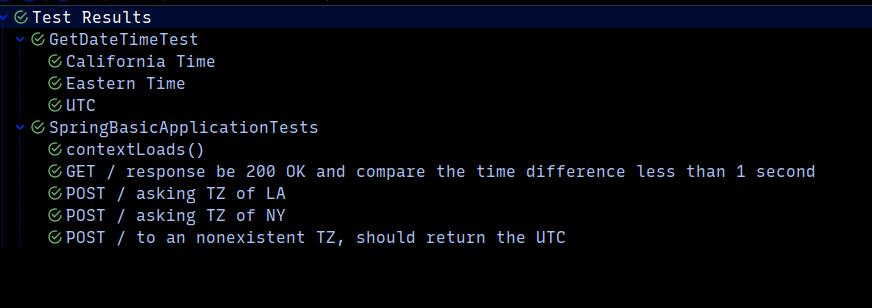

## Simple TimeZone 


| Request | Endpoint | Description |
|---------| --- | --- |
| GET | / | Get the UTC response |
| POST | / | Get the specific TimeZone |


### GET /
respond with the zulu or UTC time

`2022-08-05T16:45:02.477780291Z`  


### POST /
accepts request with the following json object as body
in this example we want to get the time for New York.
```js

{
	tz: "America/New_York"
}
```

and the response is a String

`2022-08-05T12:44:26.255024734`


### Unit and Integration tests results.

